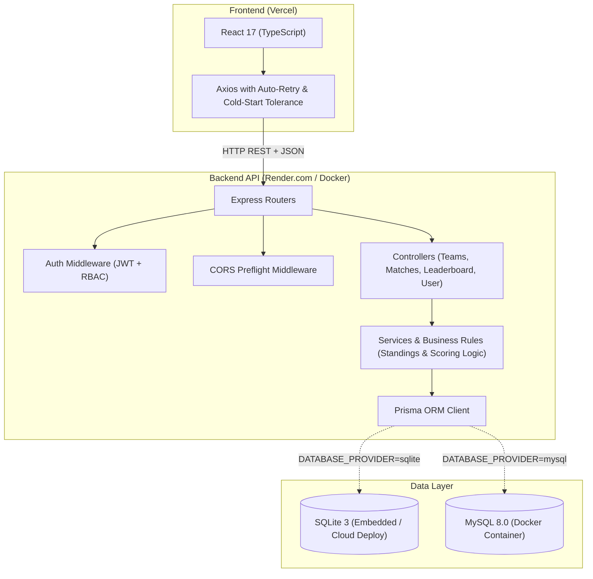

# ⚽ Futebol Clube (TFC) — Full Stack Platform

<div align="center">

[](https://www.typescriptlang.org/)
[](https://nodejs.org/)
[](https://expressjs.com/)
[](https://reactjs.org/)
[](https://www.prisma.io/)
[](https://www.sqlite.org/)
[](https://www.mysql.com/)
[](https://vitest.dev/)
[](https://www.docker.com/)
[](https://github.com/features/actions)
[](https://opensource.org/licenses/MIT)

</div>

> 🇺🇸 **English** | 🇧🇷 [**Versão em Português**](README.md)

A modern, complete Full Stack Web Platform for soccer tournament management featuring real-time dynamic leaderboards (overall, home, and away), live match creation and score updates with JWT-based RBAC access control, and dual-database support (**MySQL** and **SQLite**).

## 📌 Quick Navigation

- [📝 About the Project](#-about-the-project)
- [🖼️ Preview](#️-preview)
- [🌐 Live Application Deploy](#-live-application-deploy)
- [⚡ API Endpoints](#-api-endpoints)
- [✨ Features](#-features)
- [🛠️ Technologies and Tools](#️-technologies-and-tools)
- [🏛️ Solution Architecture](#️-solution-architecture)
- [📁 Repository Structure](#-repository-structure)
- [💡 Technical Decisions](#-technical-decisions)
- [🚀 Getting Started](#-getting-started)
- [📄 License](#-license)

## 📝 About the Project

**Futebol Clube** is a complete software ecosystem engineered to demonstrate industry-grade Full Stack Software Engineering practices. The application provides a decoupled RESTful API structured around the MSC (Model-Service-Controller) pattern, 100% strictly typed end-to-end with **TypeScript**.

The frontend interacts with the API in real time, delivering interactive standings sorted by tie-breaker rules and specialized performance filters. The system incorporates an administrative panel protected by stateless JWT authentication for scheduling matches and updating live scores with smooth animated visual feedback.

## 🖼️ Preview

<div align="center">
  
</div>

## 🌐 Live Application Deploy

Explore the deployed production application:
👉 **[Futebol Clube (Live App)](https://project-trybe-football-club.vercel.app/)**

Demo credentials for administrative features:
- **Email**: `admin@admin.com`
- **Password**: `secret_admin`

Production API URL (Render):
- `https://project-trybe-football-club.onrender.com/`

## ⚡ API Endpoints

The RESTful API provides well-structured routes, validated payloads, and standard response codes:

### Authentication (`/login`)
| Method | Endpoint | Description | Access |
| :--- | :--- | :--- | :--- |
| `POST` | `/login` | Authenticates user and returns JWT token | Public |
| `GET` | `/login/validate` | Validates token and returns current user role | Requires Bearer Token |

### Teams (`/teams`)
| Method | Endpoint | Description | Access |
| :--- | :--- | :--- | :--- |
| `GET` | `/teams` | Retrieves list of all 16 registered soccer clubs | Public |
| `GET` | `/teams/:id` | Retrieves detailed information of a specific team by ID | Public |

### Matches (`/matches`)
| Method | Endpoint | Description | Access |
| :--- | :--- | :--- | :--- |
| `GET` | `/matches` | Lists matches with optional query filtering (`?inProgress=true/false`) | Public |
| `POST` | `/matches` | Registers a new ongoing match | Requires Bearer Token |
| `PATCH` | `/matches/:id` | Updates live match score goals | Requires Bearer Token |
| `PATCH` | `/matches/:id/finish` | Finalizes match, setting in-progress status to false | Requires Bearer Token |

### Standings & Leaderboard (`/leaderboard`)
| Method | Endpoint | Description | Access |
| :--- | :--- | :--- | :--- |
| `GET` | `/leaderboard` | Consolidated overall leaderboard with official tiebreaker criteria | Public |
| `GET` | `/leaderboard/home` | Home team performance and standings | Public |
| `GET` | `/leaderboard/away` | Away team performance and standings | Public |

## ✨ Features

- **Real-Time Leaderboard Calculation**: Custom mathematical algorithms calculating points (3 for wins, 1 for draws), goal difference, goals scored/conceded, and efficiency percentage, sorted strictly by official tiebreakers.
- **Specialized Views**: One-click filtering between Overall Standings, Home Performance, and Away Performance.
- **Administrative RBAC Dashboard**: Granular route security permitting only verified administrators to register new matches, update live scores, and finish games.
- **Smooth Visual Feedback**: Stylized circular progress indicator, smart tolerance for free-tier cloud cold starts, and animated floating toasts confirming user actions.
- **Dual-Database Architecture**: Dynamic provider switching enabling embedded SQLite for cost-free cloud deploys (Render) or MySQL 8 with persistent storage for containerized setups (Docker).
- **Automated Test Coverage**: 26 unit and integration test cases covering business logic and endpoints executed in milliseconds using Vitest and Supertest.

## 🛠️ Technologies and Tools

| Layer / Purpose | Technology | Description |
| :--- | :--- | :--- |
| **Primary Language** | **TypeScript 4.9.5** | End-to-end static typing across Back-end and Front-end |
| **Runtime Environment** | **Node.js 20.x** | Scalable event-driven asynchronous JavaScript runtime |
| **Backend Web Framework** | **Express 4.17** | Routing, controllers, and centralized middleware pipeline |
| **Data Persistence** | **Prisma ORM 5.22** | Strongly-typed schema, declarative migrations, and safe queries |
| **Relational Databases** | **SQLite 3 & MySQL 8.0** | Flexibility between lightweight cloud deployment and Docker Compose |
| **UI Library** | **React 17 & TypeScript** | Component-driven architecture using functional components and hooks |
| **Security & Hashing** | **JWT & Bcrypt.js** | Stateless token-based authentication and secure password encryption |
| **Automated Testing** | **Vitest 1.6 & Supertest** | Lightning-fast test runner with native TypeScript and ESM support |
| **Containerization** | **Docker & Docker Compose** | Multi-container setup with health checks for database, API, and UI |
| **Code Quality** | **ESLint & SonarJS** | Static analysis, lint enforcement, and cognitive complexity tracking |
| **CI / CD** | **GitHub Actions** | Automated integration pipeline running linting, typechecking, and tests |

## 🏛️ Solution Architecture



## 📁 Repository Structure

```text
project-trybe-football-club/
├── .github/workflows/         # CI/CD pipeline (Lint, Typecheck, and Vitest)
├── images/                    # Visual assets and demonstration media for README
├── app/
│   ├── backend/               # Node.js + Express + TypeScript backend application
│   │   ├── prisma/            # Prisma schema, universal seed script, and SQLite database
│   │   ├── scripts/           # Dynamic database setup script (provider detection)
│   │   ├── src/
│   │   │   ├── auth/          # JWT token creation and validation
│   │   │   ├── controllers/   # Request/response handling layer
│   │   │   ├── database/      # Decoupled Prisma client instantiation
│   │   │   ├── interfaces/    # Domain TypeScript interfaces
│   │   │   ├── middlewares/   # Payload validation and access protection
│   │   │   ├── routers/       # API endpoints and route definitions
│   │   │   ├── services/      # Business logic and standings aggregation
│   │   │   └── tests/         # Automated test suite with Vitest and Supertest
│   │   ├── Dockerfile
│   │   └── vitest.config.ts
│   │
│   ├── frontend/              # React + TypeScript frontend application
│   │   ├── public/            # SVG soccer favicon and HTML template
│   │   ├── src/
│   │   │   ├── components/    # Reusable components (Tables, Filters, Toasts)
│   │   │   ├── pages/         # Page views (Leaderboard, Games, Login, MatchSettings)
│   │   │   ├── services/      # HTTP client with cold-start tolerance and retry
│   │   │   ├── styles/        # Responsive modern custom stylesheets
│   │   │   └── types/         # Core TypeScript definitions and domain models
│   │   ├── Dockerfile
│   │   └── vercel.json        # URL rewrite rules for Single Page Application routing
│   │
│   ├── docker-compose.yml     # Production-like local orchestration
│   └── docker-compose.dev.yml # Hot-reload local orchestration for development
│
├── package.json               # Root monorepo script orchestrator
├── README.md                  # Portuguese documentation
└── README.en.md               # English documentation
```

## 💡 Technical Decisions

- **Sequelize to Prisma ORM Migration**: Delivers compile-time type safety, declarative schema modeling, and eliminates silent runtime errors during numeric updates.
- **Smart Dual-Database Strategy**: Enables reviewers to launch the entire project locally on MySQL via Docker Compose while allowing frictionless, zero-cost cloud hosting on Render using embedded SQLite.
- **Frontend Refactoring to TypeScript**: Transformed legacy JSX code into strictly typed TSX components, ensuring data contracts shared between UI and API prevent regression bugs.
- **HTTP Cold-Start Tolerance**: Configured Axios with intelligent exponential backoff retry and a visual explanation card informing users when a free cloud instance is spinning up.
- **Modern Vitest & Supertest Testing**: Drastically improved test execution speed (26 tests in less than 1 second) with native TypeScript and ESM compatibility out of the box.

## 🚀 Getting Started

### Prerequisites
- [Git](https://git-scm.com/)
- [Node.js](https://nodejs.org/) (version 18 or higher)
- [Docker & Docker Compose](https://www.docker.com/) *(optional for containerized execution)*

### Option 1: Running with Docker Compose (MySQL) — Recommended

Clone the repository and spin up the complete stack with a single command:

```bash
# Clone the repository
git clone https://github.com/Ludson96/project-trybe-football-club.git
cd project-trybe-football-club

# Launch all services (MySQL + Back-end + Front-end)
npm run compose:up
```

Local URLs:
- **Front-end**: [http://localhost:3000](http://localhost:3000)
- **Back-end API**: [http://localhost:3001](http://localhost:3001)

To stop the containers:
```bash
npm run compose:down
```

### Option 2: Running Locally with SQLite (No Docker Required)

1. **Setup and launch the Back-end**:
```bash
cd app/backend
npm install
npm run db:setup
npm run dev
```
*API will be listening at `http://localhost:3001`.*

2. **Launch the Front-end**:
```bash
cd ../frontend
npm install
npm start
```
*The app will automatically open at `http://localhost:3000`.*

### Running Automated Tests and Type Checks

```bash
# Run Vitest test suite (Back-end)
cd app/backend && npm test

# TypeScript compilation check (Back-end)
npm run build

# TypeScript compilation check (Front-end)
cd ../frontend && npm run typecheck

# Code linting check (Back-end)
cd ../backend && npm run lint
```

## 📄 License

This project is licensed under the **MIT** License. See the `LICENSE` file for more details.

<div align="center">
  Developed by <strong>Ludson Pereira dos Santos</strong> 🚀<br />
  <a href="https://www.linkedin.com/in/ludson96/">LinkedIn</a> • <a href="https://github.com/ludson96">GitHub</a> • <a href="mailto:ludson_ps27@hotmail.com">Email</a>
</div>
