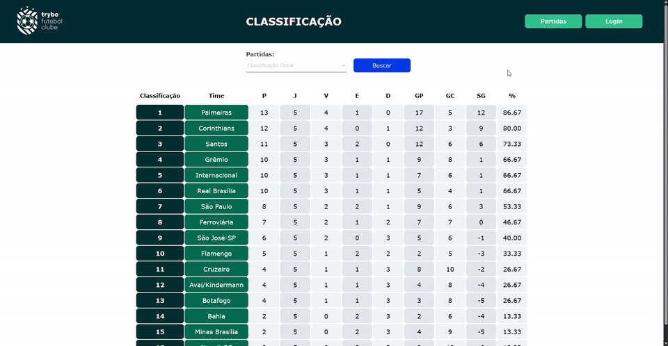
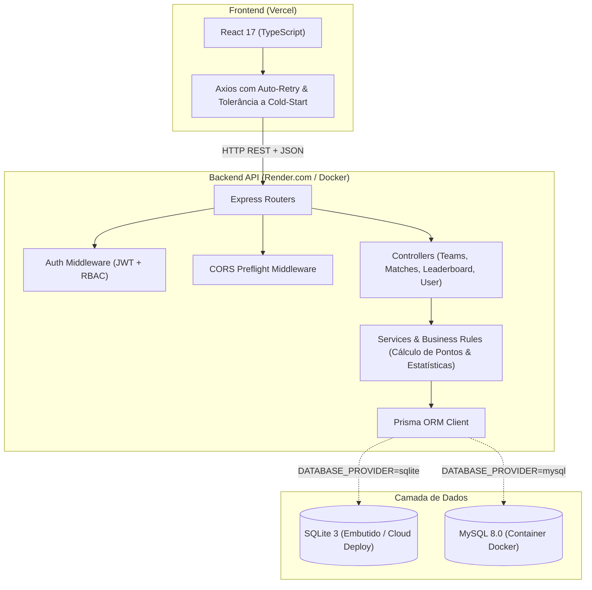

# ⚽ Futebol Clube (TFC) — Full Stack Platform

<div align="center">

[](https://www.typescriptlang.org/)
[](https://nodejs.org/)
[](https://expressjs.com/)
[](https://reactjs.org/)
[](https://www.prisma.io/)
[](https://www.sqlite.org/)
[](https://www.mysql.com/)
[](https://vitest.dev/)
[](https://www.docker.com/)
[](https://github.com/features/actions)
[](https://opensource.org/licenses/MIT)

</div>

> 🇧🇷 **Português** | 🇺🇸 [**English Version**](README.en.md)

Plataforma Web Full Stack completa e moderna para gerenciamento de campeonatos de futebol, com classificação dinâmica calculada em tempo real (geral, mandante e visitante), criação e atualização de partidas ao vivo com controle de acesso RBAC via JWT e suporte híbrido a múltiplos bancos de dados (**MySQL** e **SQLite**).

## 📌 Navegação Rápida

- [📝 Sobre o Projeto](#-sobre-o-projeto)
- [🖼️ Preview](#️-preview)
- [🌐 Deploy da Aplicação](#-deploy-da-aplicação)
- [⚡ API Endpoints](#-api-endpoints)
- [✨ Funcionalidades](#-funcionalidades)
- [🛠️ Tecnologias e Ferramentas Utilizadas](#️-tecnologias-e-ferramentas-utilizadas)
- [🏛️ Arquitetura da Solução](#️-arquitetura-da-solução)
- [📁 Estrutura do Repositório](#-estrutura-do-repositório)
- [💡 Decisões Técnicas](#-decisões-técnicas)
- [🚀 Como Executar o Projeto](#-como-executar-o-projeto)
- [📄 Licença](#-licença)

## 📝 Sobre o Projeto

O **Futebol Clube** é um ecossistema completo desenvolvido para consolidar boas práticas de Engenharia de Software Full Stack. A aplicação entrega uma API RESTful em arquitetura em camadas (MSC - Model-Service-Controller) desacoplada e 100% tipada de ponta a ponta com **TypeScript**.

O frontend consome a API em tempo real, fornecendo tabelas interativas de classificação por aproveitamento e filtros avançados. O sistema implementa uma camada administrativa protegida por autenticação JWT para criação de confrontos e edição instantânea de placares com feedback visual animado.

## 🖼️ Preview

<div align="center">
  
</div>

## 🌐 Deploy da Aplicação

Acesse a aplicação em produção:
👉 **[Futebol Clube (App Online)](https://project-trybe-football-club.vercel.app/)**

Credenciais para teste da área administrativa:
- **E-mail**: `admin@admin.com`
- **Senha**: `secret_admin`

URL da API em Produção (Render):
- `https://project-trybe-football-club.onrender.com/`

## ⚡ API Endpoints

A API expõe rotas RESTful organizadas com payloads validados e respostas padronizadas:

### Autenticação (`/login`)
| Método | Endpoint | Descrição | Autenticação |
| :--- | :--- | :--- | :--- |
| `POST` | `/login` | Autentica usuário e retorna token JWT | Pública |
| `GET` | `/login/validate` | Valida o token recebido e retorna o papel (`role`) do usuário | Requer Bearer Token |

### Times (`/teams`)
| Método | Endpoint | Descrição | Autenticação |
| :--- | :--- | :--- | :--- |
| `GET` | `/teams` | Retorna a lista de todos os 16 clubes cadastrados | Pública |
| `GET` | `/teams/:id` | Retorna informações detalhadas de um clube específico por ID | Pública |

### Partidas (`/matches`)
| Método | Endpoint | Descrição | Autenticação |
| :--- | :--- | :--- | :--- |
| `GET` | `/matches` | Lista partidas com filtro opcional (`?inProgress=true/false`) | Pública |
| `POST` | `/matches` | Registra uma nova partida em andamento | Requer Bearer Token |
| `PATCH` | `/matches/:id` | Atualiza o placar de gols da partida | Requer Bearer Token |
| `PATCH` | `/matches/:id/finish` | Finaliza a partida e encerra o status em andamento | Requer Bearer Token |

### Classificação (`/leaderboard`)
| Método | Endpoint | Descrição | Autenticação |
| :--- | :--- | :--- | :--- |
| `GET` | `/leaderboard` | Tabela de classificação consolidada (geral) com critérios de desempate | Pública |
| `GET` | `/leaderboard/home` | Desempenho e classificação dos clubes como mandantes | Pública |
| `GET` | `/leaderboard/away` | Desempenho e classificação dos clubes como visitantes | Pública |

## ✨ Funcionalidades

- **Cálculo de Classificação ao Vivo**: Algoritmo matemático que processa pontuação (3 pontos por vitória, 1 por empate), saldo de gols, gols pró/contra e percentual de aproveitamento com ordenação por critérios de desempate oficiais.
- **Visualização Especializada**: Filtros rápidos para alternar entre Classificação Geral, Desempenho dos Mandantes e Desempenho dos Visitantes.
- **Painel Administrativo com RBAC**: Proteção granular de rotas que permite apenas a administradores cadastrar novas partidas, editar gols e encerrar jogos.
- **Feedback Visual Fluido**: Indicador de carregamento circular estilizado, tolerância a *cold start* de provedores de nuvem gratuitos e toasts flutuantes animados com confirmação imediata de ações.
- **Arquitetura Dual Database**: Suporte dinâmico a SQLite embutido para implantação leve e sem custos adicionais em cloud (Render) ou MySQL 8 com persistência para ambientes containerizados (Docker).
- **Cobertura Automatizada de Testes**: Bateria com 26 testes de integração e regras de negócio executados em milissegundos via Vitest e Supertest.

## 🛠️ Tecnologias e Ferramentas Utilizadas

| Camada / Finalidade | Tecnologia | Descrição |
| :--- | :--- | :--- |
| **Linguagem Principal** | **TypeScript 4.9.5** | Tipagem estática fim a fim no Back-end e Front-end |
| **Ambiente de Execução** | **Node.js 20.x** | Runtime assíncrono escalável baseado em eventos |
| **Framework Web Back-end** | **Express 4.17** | Roteamento, controllers e middlewares centralizados |
| **Persistência de Dados** | **Prisma ORM 5.22** | Mapeamento tipado e queries seguras com migrations declarativas |
| **Bancos de Dados Relacionais** | **SQLite 3 & MySQL 8.0** | Flexibilidade entre ambiente cloud leve e Docker Compose |
| **Biblioteca de Interface** | **React 17 & TypeScript** | Componentização modular com hooks de ciclo de vida e estado |
| **Segurança e Criptografia** | **JWT & Bcrypt.js** | Autenticação stateless via tokens e hashing seguro de senhas |
| **Testes Automatizados** | **Vitest 1.6 & Supertest** | Suíte de testes de integração e controllers com execução ultra-rápida |
| **Containerização** | **Docker & Docker Compose** | Orquestração com healthchecks para banco, api e frontend |
| **Qualidade de Código** | **ESLint & SonarJS** | Análise estática, padronização de código e complexidade cognitiva |
| **CI / CD** | **GitHub Actions** | Pipeline automatizada com linting, checagem de tipos e testes |

## 🏛️ Arquitetura da Solução



## 📁 Estrutura do Repositório

```text
project-trybe-football-club/
├── .github/workflows/         # Pipeline de CI/CD (Lint, Typecheck e Vitest)
├── images/                    # Recursos visuais e mídias de demonstração para o README
├── app/
│   ├── backend/               # Aplicação Back-end Node.js + Express + TypeScript
│   │   ├── prisma/            # Schema do Prisma, seeders universais e banco SQLite
│   │   ├── scripts/           # Script dinâmico de setup de banco (detecta provider)
│   │   ├── src/
│   │   │   ├── auth/          # Geração e validação de tokens JWT
│   │   │   ├── controllers/   # Camada de controle e orquestração de requisições
│   │   │   ├── database/      # Inicialização desacoplada do cliente Prisma
│   │   │   ├── interfaces/    # Interfaces TypeScript dos modelos de dados
│   │   │   ├── middlewares/   # Validações de payload e regras de acesso
│   │   │   ├── routers/       # Mapeamento de rotas e endpoints
│   │   │   ├── services/      # Regras de negócio e agregação de dados da classificação
│   │   │   └── tests/         # Testes automatizados com Vitest e Supertest
│   │   ├── Dockerfile
│   │   └── vitest.config.ts
│   │
│   ├── frontend/              # Aplicação Front-end React + TypeScript
│   │   ├── public/            # Favicon temático SVG e template HTML
│   │   ├── src/
│   │   │   ├── components/    # Componentes reutilizáveis (Tabelas, Filtros, Toasts)
│   │   │   ├── pages/         # Páginas (Leaderboard, Games, Login, MatchSettings)
│   │   │   ├── services/      # Cliente HTTP com tolerância a cold-start e retry
│   │   │   ├── styles/        # Estilos customizados e responsivos
│   │   │   └── types/         # Definições centrais de tipos e interfaces do domínio
│   │   ├── Dockerfile
│   │   └── vercel.json        # Configuração de rewrites para Single Page Application
│   │
│   ├── docker-compose.yml     # Orquestração para ambiente de produção local
│   └── docker-compose.dev.yml # Orquestração com hot-reload para desenvolvimento
│
├── package.json               # Gerenciador raiz com scripts de conveniência
└── README.md
```

## 💡 Decisões Técnicas

- **Substituição do Sequelize pelo Prisma ORM**: Proporciona checagem estrita de tipos em tempo de compilação, prevenção de erros em runtime em colunas numéricas/relacionais e schemas limpos e declarativos.
- **Arquitetura Dual-Database Inteligente**: Permite ao avaliador executar o projeto completo localmente com MySQL via Docker Compose, ao mesmo tempo em que viabiliza o deploy em serviços gratuitos na nuvem (Render) utilizando SQLite sem necessidade de contratar servidores externos de banco.
- **Migração do Frontend para TypeScript**: O código JavaScript anterior foi inteiramente refatorado para TSX, garantindo que contratos de API e modelos de dados compartilhados impeçam regressões de tipagem.
- **Tolerância a Cold-Start no Cliente HTTP**: O Axios foi configurado com interceptor inteligente de retentativa e timeout estendido, acompanhado de avisos visuais ao usuário quando a API hospedada em instâncias gratuitas estiver acordando de sua hibernação.
- **Migração para Vitest & Supertest**: Redução expressiva do tempo de execução da suíte de testes (26 testes em menos de 1 segundo), integrando nativamente suporte a TypeScript e ESM.

## 🚀 Como Executar o Projeto

### Pré-requisitos
- [Git](https://git-scm.com/)
- [Node.js](https://nodejs.org/) (versão 18 ou superior)
- [Docker & Docker Compose](https://www.docker.com/) *(opcional para execução via container)*

### Opção 1: Execução com Docker Compose (MySQL) — Recomendado

Clone o repositório e execute a stack completa em um único comando:

```bash
# Clonar o repositório
git clone https://github.com/Ludson96/project-trybe-football-club.git
cd project-trybe-football-club

# Subir a aplicação completa (MySQL + Back-end + Front-end)
npm run compose:up
```

Acessos locais:
- **Front-end**: [http://localhost:3000](http://localhost:3000)
- **Back-end API**: [http://localhost:3001](http://localhost:3001)

Para encerrar os containers:
```bash
npm run compose:down
```

### Opção 2: Execução Local Rápida com SQLite (Sem necessidade de Docker)

1. **Configurar e inicializar o Back-end**:
```bash
cd app/backend
npm install
npm run db:setup
npm run dev
```
*A API estará ativa em `http://localhost:3001`.*

2. **Inicializar o Front-end**:
```bash
cd ../frontend
npm install
npm start
```
*O app abrirá automaticamente em `http://localhost:3000`.*

### Executando os Testes e Verificações de Tipos

```bash
# Executar a suíte de testes com Vitest (Back-end)
cd app/backend && npm test

# Checagem de tipagem estática (Back-end)
npm run build

# Checagem de tipagem estática (Front-end)
cd ../frontend && npm run typecheck

# Análise de linting (Back-end)
cd ../backend && npm run lint
```

## 📄 Licença

Este projeto está licenciado sob os termos da licença **MIT**. Consulte o arquivo `LICENSE` para mais detalhes.

<div align="center">
  Desenvolvido por <strong>Ludson Pereira dos Santos</strong> 🚀<br />
  <a href="https://www.linkedin.com/in/ludson96/">LinkedIn</a> • <a href="https://github.com/ludson96">GitHub</a> • <a href="mailto:ludson_ps27@hotmail.com">E-mail</a>
</div>
